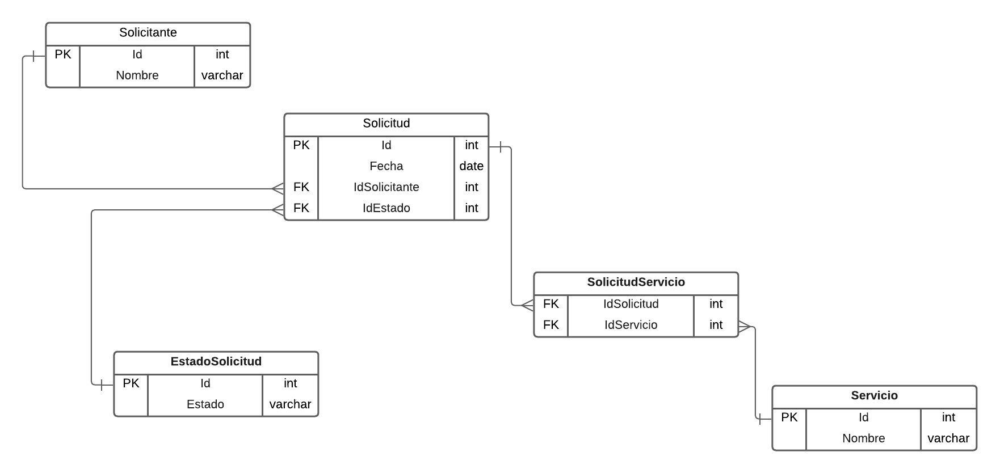

# TechnicalTestEmployee

Sistema de Gestión de Empleados

Este proyecto consiste en una prueba técnica, la cual está estructurada de la siguiente forma:

<ul>
  <li>employeesApi - API Desarrollada con NetCore 8</li>
  <li>employeesClient - Cliente desarrollado en Angular (versión 17).</li>
</ul>

Se desarrolla este proyecto teniendo en cuenta las versiones más actuales y estables de las tecnologías anteriormente mencionadas. Se tienen en cuenta patrones de desarrollo y código limpio para que sea escalable en el futuro.

### Desarrollo de la prueba

Para que la aplicación funcione correctamente, es necesario tener en cuenta los siguientes pasos:

Obtener el repositorio <link> https://github.com/miller1301/TechnicalTestEmployees

### Base de datos

La base de datos utilizada en este proyecto es SQLServer, dentro del proyecto "employeesApi" del API en NETCore, se encuentran la carpeta "Migrations" que contiene todos los archivos que se podrán ejecutar para:

<ul>
  <li>Creación de la base de datos</li>
  <li>Creación de las tablas</li>
  <li>Definición de las entidades en las tablas</li>
  <li>Asignación de las llaves foráneas</li>
</ul>

El comando requerido para ejecutar en la consola de administrador de paquetes es: `Update-database`

### TaskClient
En este proyecto se encuentra la estructura del cliente, que se desarrolló en Angular 17.
En la ruta de la carpeta <strong>\employeeClient</strong> ejecutar <code>npm install</code>, para obtener todos los paquetes requeridos para que el cliente funcione. En el cliente, se pueden realizar las operaciones CRUD y los demás puntos solicitados.

Para el consumo de la API desde el cliente se, utiliza `HttpClient`, ya que con este objeto se realizan solicitudes HTTP y se maneja la respuesta del servidor. El servicio HttpClient tiene la responsabilidad de implementar otras funcionalidades como interceptores y encabezados.

### TaskAPI
En este proyecto se encuentra el backend de la aplicación construido en .NetCore 8. Este proyecto se desarrollo implementando desarrollo por capas incluyendo servicios, controladores, DTO's, repositorios, contextos e interfaces, esto permite una correcta separación de responsabilidades cumpliendo con los estándares de Clean Code y patrones de diseño.

### Estructura del proyecto

<ul>
  <li>Context</li>
  <li>Controllers</li>
  <li>Data</li>
  <li>DTO</li>
  <li>Interfaces</li>
  <li>Migrations</li>
  <li>Models</li>
</ul>

Se integra el ORM (Object Relational Mapping) Entity Framework, el cual nos ayuda a mapear las entidades de la base de datos en nuestra API.

Ejecutar la aplicación para que el cliente pueda recibir las peticiones.

### SQL Query
En la carpeta "services_NN_SA" de este repositorio se encuentra el diagrama de referencía utilizado para el segundo punto de la prueba que consiste en realizar una solución informática que permita atender las solicitudes de servicios para la empresa "NN S.A".

Adicionalmente el archivo `sql_query_2.sql`, en este archivo Script está definido lo siguiente:

<ol>
  <li>Creación de la base de datos</li>
  <li>Creación de las tablas</li>
  <li>Inserción de datos de prueba</li>
  <li>Consulta para obtener datos</li>
</ol>

*-- TechnicalTestEmployee*